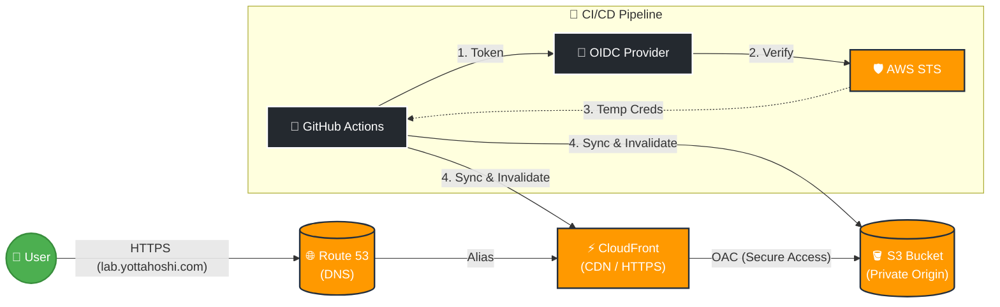

# AWS S3 + CloudFront + GitHub Actions (OIDC) 構築メモ

- **作成日:** 2025-11-22
- **目的:** AWS S3とCloudFrontを使用したセキュアな静的サイトホスティングと、GitHub Actions (OIDC) によるCI/CDパイプラインの構築。

## 🏗 アーキテクチャ構成 (Level 1.5)



## 🛠 作成したリソース一覧

### 1. CloudFront (CDN)
*   **ドメイン:** `lab.yottahoshi.com` (Route 53 Alias)
*   **SSL証明書:** ACM (us-east-1)
*   **オリジン設定:** OAC (Origin Access Control) を使用し、S3への直接アクセスを禁止。
*   **WAF:** コスト削減のため無効化 (Security protections: Off)

### 2. S3 バケット (Origin)
*   **バケット名:** `<AWS_BUCKET_NAME>`
*   **公開設定:**
    *   **パブリックアクセスブロック: ON (完全非公開)**
    *   バケットポリシー: CloudFront (OAC) と IAMロールからのアクセスのみ許可。

### 3. IAM (Security)
*   **IAMロール:** `GitHubAction-S3-Deploy-Role`
    *   **ARN:** `<AWS_ROLE_ARN>`
    *   **権限:** `AmazonS3FullAccess` + `CloudFrontFullAccess` (キャッシュ削除用)
*   **認証方式:** OIDC (OpenID Connect)

### 4. GitHub (CI/CD)
*   **リポジトリ:** `aws-s3-oidc-demo`
*   **Secrets:**
    *   `AWS_ROLE_ARN`: IAMロールのARN
    *   `AWS_BUCKET_NAME`: S3バケット名
    *   `CLOUDFRONT_DISTRIBUTION_ID`: キャッシュ削除対象のID

---

## 💡 技術的なポイント (SAA視点)

### セキュリティ強化 (OAC)
*   **S3直接公開の廃止:** S3の「静的ウェブサイトホスティング」機能は使用せず、REST APIエンドポイントを使用。
*   **OAC (Origin Access Control):** CloudFrontのみがS3データを読み取れるようバケットポリシーを制限。これにより、ユーザーによるS3への直接アクセスや、コンテンツの「直抜き」を防止。

### HTTPS化と証明書
*   **ACM:** CloudFrontで使用するSSL証明書は、仕様により必ず **us-east-1 (バージニア北部)** リージョンで発行する必要がある点に注意。

### コスト最適化
*   **データ転送量:** S3直接公開（従量課金）からCloudFront経由（月1TBまで無料）に変更することでコストを削減。
*   **WAF:** 個人検証用のため無効化し、固定費 ($5/月) を回避。

---

## 🗑️ 後片付け (削除手順)

不要になったら以下の順序で削除してください。

1. **CloudFront & Route 53**
   * Route 53 の Aレコード (`lab`) を削除。
   * CloudFront ディストリビューションを **Disable (無効化)** してから **Delete (削除)**。
   * ACM 証明書 (`us-east-1`) を削除。

2. **S3バケット**
   ```bash
   aws s3 rm s3://<AWS_BUCKET_NAME> --recursive
   aws s3 rb s3://<AWS_BUCKET_NAME>
   ```

3. **IAMロール**
   ```bash
   aws iam delete-role --role-name GitHubAction-S3-Deploy-Role
   ```