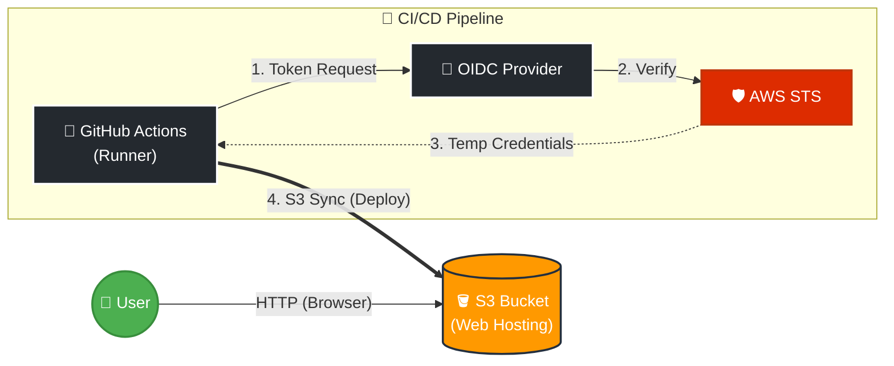

# AWS S3 + GitHub Actions (OIDC) 構築メモ

**作成日:** 2025-11-22
**目的:** AWS S3への静的サイトホスティングと、GitHub Actions + OIDCを使用したセキュアなCI/CDパイプラインの検証。

## 🏗 アーキテクチャ構成



## 🛠 作成したリソース一覧

### 1. S3 バケット (Hosting)
*   **バケット名:** `<AWS_BUCKET_NAME>`
*   **リージョン:** `ap-northeast-1` (東京)
*   **公開設定:**
    *   静的ウェブサイトホスティング: **有効** (`index.html`)
    *   パブリックアクセスブロック: **OFF** (すべて許可)
    *   バケットポリシー: `Principal: *` に対して `s3:GetObject` を許可
*   **タグ:**
    *   `System`: `study-s3`
    *   `CreatedDate`: `2025-11-22`

### 2. IAM (Security)
*   **IDプロバイダ (OIDC):**
    *   URL: `https://token.actions.githubusercontent.com`
    *   Audience: `sts.amazonaws.com`
*   **IAMロール:** `GitHubAction-S3-Deploy-Role`
    *   **ARN:** `<AWS_ROLE_ARN>`
    *   **信頼ポリシー (Trust Policy):** GitHubの特定リポジトリ (`yottahoshi/aws-s3-oidc-demo`) からのみ `AssumeRole` を許可。
    *   **許可ポリシー:** `AmazonS3FullAccess`

### 3. GitHub (Source)
*   **リポジトリ:** `aws-s3-oidc-demo`
*   **ワークフロー:** `.github/workflows/deploy.yml`
*   **認証方式:** アクセスキー（AK/SK）は不使用。`aws-actions/configure-aws-credentials` によるOIDC認証を採用。

---

## 💡 技術的なポイント (備忘録)

### なぜ OIDC を使ったか？
*   従来の「IAMユーザーのアクセスキー」をGitHub Secretsに保存する方法は、キー漏洩のリスクがあるため。
*   OIDCを使用することで、**一時的な認証情報 (STS)** のみを使用し、長期的なクレデンシャルを持たない「キーレス」な構成を実現した。

### S3のアクセス権限について
CloudFrontを使用しない構成のため、S3自体をパブリック公開している。
1.  **ブロックパブリックアクセス:** これをOFFにしないと、バケットポリシーで許可しても弾かれる（安全装置）。
2.  **バケットポリシー:** ここで明示的に `Allow` を書かないと、暗黙のDenyによりアクセスできない。

---

## ⚠️ リスクと運用注意点
1.  **セキュリティ (HTTP):**
    *   現在はS3直接公開のため、通信は暗号化されていない (HTTP)。
    *   ブラウザでは「保護されていない通信」と表示される。
2.  **コスト (EDoS攻撃):**
    *   誰でもアクセス可能なため、大量リクエストを受けるとS3のリクエスト料金・転送量課金が高額になるリスクがある。
    *   ※長期運用の際は AWS Budgets アラートを確認すること。

## 🚀 Next Step (改善案)
*   **HTTPS化:** CloudFront + ACM を導入し、SSL化する。
*   **セキュリティ強化:** S3のパブリックアクセスをブロックし、CloudFrontからのアクセスのみ許可する (OAC設定)。

---

## 🗑️ 後片付け (削除手順)

半年後の自分へ。不要になったら以下の手順で削除してください。

1. **S3バケットの削除 (中身を空にしてから)**
   ```bash
   # 中身を全削除 (危険なので注意)
   aws s3 rm s3://<AWS_BUCKET_NAME> --recursive
   
   # バケットを削除
   aws s3 rb s3://<AWS_BUCKET_NAME>
   ```

2. **IAMロールの削除**
   ```bash
   aws iam delete-role --role-name GitHubAction-S3-Deploy-Role
   ```

3. **GitHubリポジトリ**
   * Settings -> "Delete this repository" から削除。
```